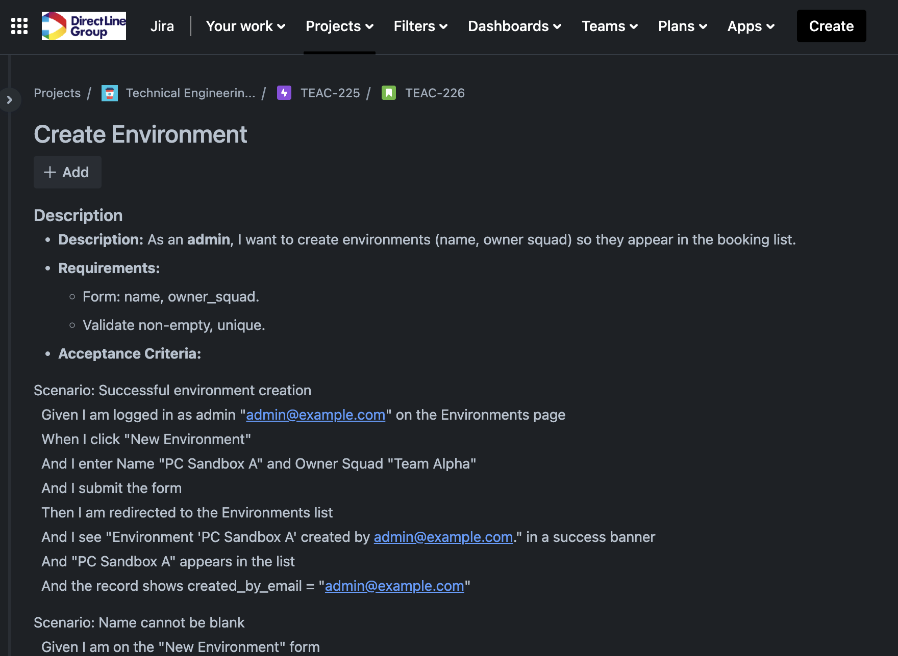
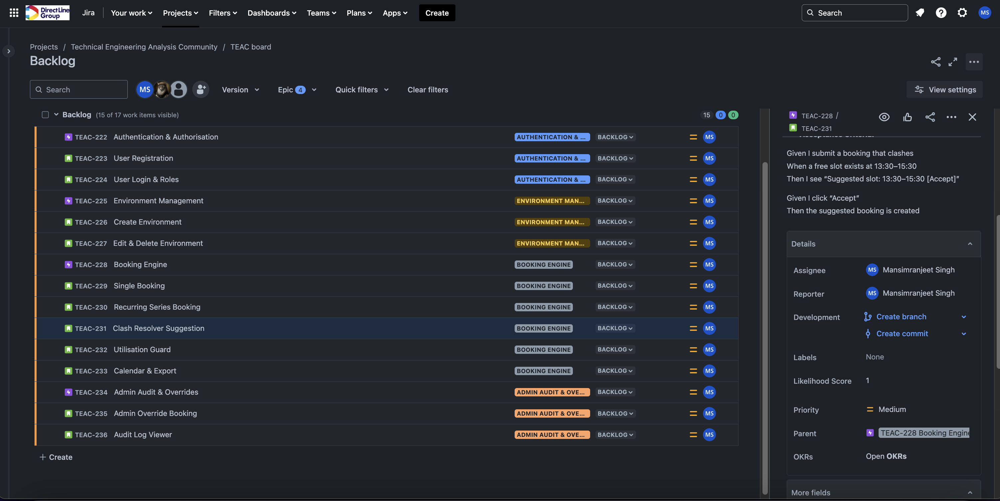
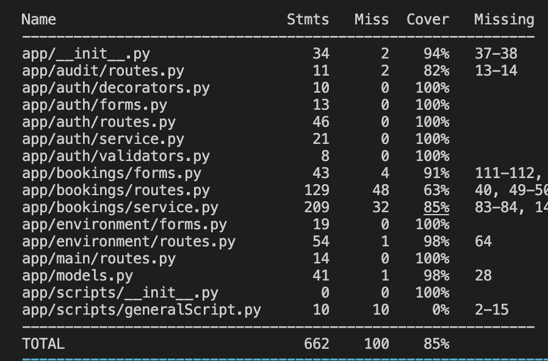
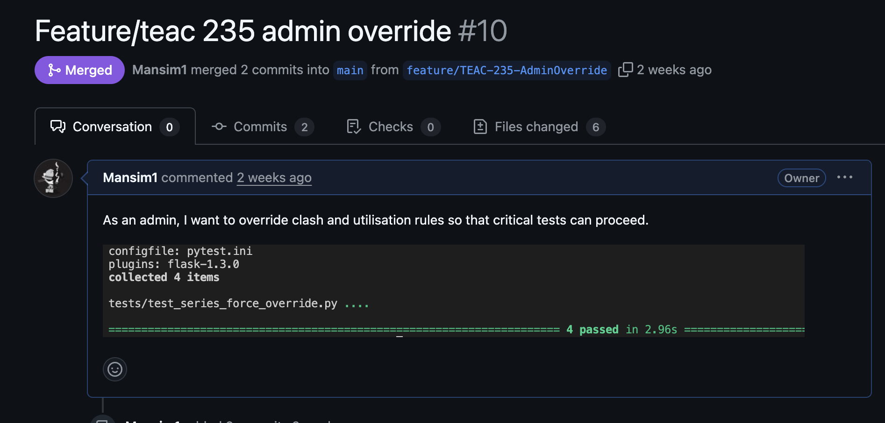
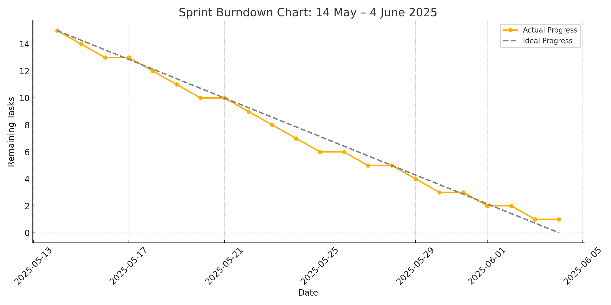

# Agile Artefacts Used in Project

This project was developed independently, but Agile was embedded at every stage of delivery. By incorporating core Scrum-aligned artefacts and processes, I ensured iterative progress, continuous feedback through testing, and a clear sense of deliverable quality.

## 1. Jira Board – Iterative Sprint Planning and Story Tracking

I used a Jira board to simulate sprint planning and backlog management, aligning with Scrum principles. The board was structured with epics and stories across two-week sprints, and tasks were updated as work progressed.

**Examples of story-level tickets:**
Below is an example of a structured user story used during development to plan and track the "Create New Environment" feature:

This story helped clarify scope early. By outlining acceptance criteria, I avoided mid-sprint ambiguities, such as whether the environment needed booking availability right away. The image above reflects how structured ticketing aligned development tasks with product goals and improved focus.

Additional stories in the board followed the same format and tracked features like:
- Force-booking with admin override
- Booking audit log system
- Conflict detection in time ranges

- **Value**: This artefact enabled me to visualise the flow of work, understand scope creep, and track sprint outcomes. It was especially useful for reflecting on unplanned work and backlog refinement.
- **Limitation**: As a solo developer, there was no real collaboration or cross-functional involvement, limiting the true dynamic of Scrum ceremonies like sprint review or retrospective.
- **Learning**: The Jira board taught me to structure work in manageable increments and prioritise features iteratively, avoiding big-bang development.

---

## 2. Test-Driven Development (TDD)

I employed TDD as a technical Agile practice using `pytest` to ensure correctness across all booking logic and edge cases. Every major service function, such as booking creation, conflict detection, admin override, and recurring generation was developed with associated tests.

### Example Tests:
- `test_conflict_detection_blocks_overlapping_bookings()`
- `test_admin_can_force_booking_despite_conflict()`
- `test_series_generation_respects_weekdays_and_time_bounds()`

- **Strength**: TDD gave me early warnings about logical flaws, encouraged smaller function units, and allowed confident refactoring. It also enforced business rules early, such as rejecting bookings that exceed the daily utilisation cap.
- **Challenge**: Writing tests before code initially slowed me down, especially for complex date and recurrence logic. However, it resulted in fewer bugs and rework later.
- **Agile Relevance**: TDD embodies the principle of “working software as the primary measure of progress,” enabling me to validate features independently.

#### Pytest Report

#### Tests-Passing on PRs
Every pull request and ticket was only closed after attaching a screenshot showing all relevant tests passing:

---

## 3. Burndown Chart – Velocity and Scope Tracking

A manually updated burndown chart was used to simulate sprint progress. It tracked remaining backlog items against sprint days in Excel. The slope of the graph gave real-time insight into pacing.

### Critical Evaluation:
- **Effectiveness**: The chart provided a visual cue to track whether I was on course. Mid-sprint, I identified that UI-related stories were blocking functional progress, leading to reprioritisation.
- **Limitation**: Being solo, the burn-down data lacked team-wide variability, and progress often spiked due to batch updates rather than incremental story completion.
- **Outcome**: It taught me the importance of small, shippable increments and continuous review—both core to Agile delivery.

---

## 4. Definition of Done (DoD)

I defined a strict internal DoD to standardise quality. This included:

- Passing unit tests and validation logic
- Frontend validation + flash messaging
- Functional audit logging for admin actions
- Booking suggestions and override mechanics
- Clean code formatting using `black` and `isort`

- **Value**: The DoD ensured production-readiness for each feature. It acted as a final checklist before closing a story and enabled predictable quality.
- **Improvement Area**: Without peer review, enforcement of DoD relied solely on my discipline. Future projects could benefit from automated linting, PR review processes, and CI/CD integration for enforcement.
- **Agile Link**: The DoD enforced a clear understanding of “done,” reducing ambiguity and aligning with Scrum best practices.

---

## Summary and Reflection

Each Agile artefact contributed significantly to the structure, focus, and quality of the Environment Booker project. Despite the lack of a formal team, these practices allowed me to internalise Agile values such as iterative delivery, self-reflection, and sustainable pace.

**Improvements for Future Work:**
- Integrate CI/CD pipelines to automate test execution and linting.
- Involve a peer reviewer or mentor to simulate collaborative review and retrospective feedback.
- Use story points and velocity tracking for more refined planning.

---

