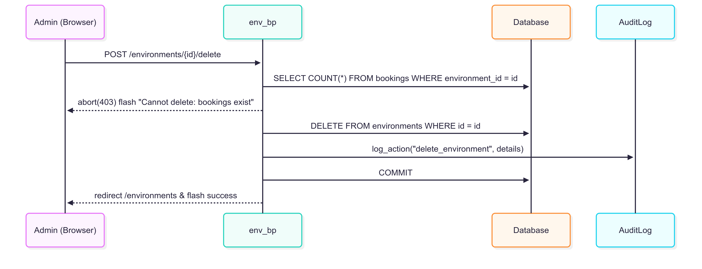

<!-- docs/architecture.md -->

# Architecture & Component Design

This document describes the high-level architecture, the major components and their interactions in the **Environment Booker** web application.

---

## 1. Architectural Overview

The application follows a **layered** (n-tier) architecture:

- **Presentation Layer**  
  • Browser + Jinja2 templates + Bootstrap, DataTables, timeago.js, dark-mode toggle  
- **Application Layer**  
  • Flask Blueprints for routing  
  • Service classes (`AuthService`, `BookingService`) encapsulating business logic  
- **Data Layer**  
  • Models via Flask-SQLAlchemy ORM  
  • Underlying RDBMS (SQLite for dev, MySQL in prod)

---

## 2. Components

### 2.1 Flask Blueprints

| Blueprint         | URL Prefix       | Responsibilities                               |
|-------------------|------------------|-----------------------------------------------|
| **main_bp**       | `/`              | Dashboard, home redirects                     |
| **auth_bp**       | `/auth`          | Register, login, logout                       |
| **env_bp**        | `/environments`  | CRUD on Environments (admin only)             |
| **bookings_bp**   | `/bookings`      | Single & series bookings                      |
| **audit_bp**      | `/audit`         | View audit logs                               |

### 2.2 Service Layer

- **AuthService**  
  • `register(email, password, role)` → creates & hashes password  
  • `authenticate(email, password)` → checks credentials  

- **BookingService**  
  • Validates duration, daily cap, overlap per-environment  
  • Single & series booking logic, suggestions, “force” override  
  • Writes AuditLog entries for every mutation  

### 2.3 Data Models

| Model           | Table           | Key Columns                                             |
|-----------------|-----------------|---------------------------------------------------------|
| **User**        | `users`         | `id`, `email`, `password_hash`, `role`                 |
| **Environment** | `environments`  | `id`, `name`, `owner_squad`, `created_by_email`        |
| **Booking**     | `bookings`      | `id`, `environment_id → environments.id`, `user_id → users.id`, `start`, `end` |
| **AuditLog**    | `audit_log`     | `id`, `action`, `actor_id → users.id`, `timestamp`, `details` |

---

## 3. Key Workflows

### 3.1 Single Booking Creation

1. **User** submits POST `/bookings/new` with `env`, `start`, `end`.  
2. **bookings_bp** calls `BookingService.attempt_single_booking()`.  
3. **BookingService** runs validations (duration, overlap, cap) scoped to that environment.  
4. On success: inserts `Booking`, logs `AuditLog`, returns booking.  
5. **bookings_bp** flashes success and redirects to `/bookings`.

### 3.2 Environment Deletion

1. **Admin** clicks “Delete” on an environment row.  
2. **env_bp** checks for any existing `Booking` with that `environment_id`.  
3. - If found: abort with 403 + flash “Cannot delete: bookings exist.”  
   - Else: deletes `Environment`, logs `AuditLog`, commits.  
4. **env_bp** redirects back to `/environments` with success message.

---

## 4. Security

- **Role-based access control** with `@login_required` and custom `@admin_required`
- **WTForms** for input validation (ensures required fields, proper types)
- **Password hashing**: Werkzeug’s `pbkdf2:sha256` with salt
- **Audit logs** for all create/update/delete actions, capturing actor, timestamp, details
- **XSS protection**: Jinja2 auto-escaping by default; use `Markup` only when safe
- **CDN assets** loaded with **SRI** and `crossorigin` attributes for integrity
- **Accessibility**:  
  - “Skip to main content” link  
  - Proper ARIA roles/landmarks (`<nav role="navigation">`, `<main role="main">`, `<footer role="contentinfo">`)  
  - Dynamic “active” nav highlighting
