# Environment Booker: User Guide & UI Walkthrough

This guide will walk you through each page, explain all UI elements, and show you how to perform common tasks.

---

## Table of Contents

1. [Getting Started](#getting-started)  
2. [Login & Registration](#login--registration)  
   - [Regular User Registration](#regular-user-registration)  
   - [Admin Registration](#admin-registration)  
3. [Dashboard](#dashboard)  
4. [Managing Environments (Admin)](#managing-environments-admin)  
   - [List Environments](#list-environments)  
   - [Creating & Editing an Environment](#creating--editing-an-environment)  
   - [Deleting an Environment](#deleting-an-environment)  
5. [Managing Bookings](#managing-bookings)  
   - [List & Filter Bookings](#list--filter-bookings)  
   - [Single Booking](#single-booking)  
   - [Series Booking](#series-booking)  
   - [Conflict Suggestions & Force Book](#conflict-suggestions--force-book)  
6. [Audit Log](#audit-log)  
7. [Dark/Light Mode](#darklight-mode)  
8. [Keyboard Shortcuts & Accessibility](#keyboard-shortcuts--accessibility)  

---

## Getting Started

1. Navigate to the app - `https://mansim.pythonanywhere.com/`
2. If you already have an account, click **Login**; otherwise, proceed to **Registration**.

---

## Login & Registration

### Regular User Registration

1. Click **Sign Up** on the navbar or at the bottom of the Login page.  
2. Fill in your **Email** and **Password**, then click **Register**.  
3. After successful registration, you’ll be redirected to the **Login** page.

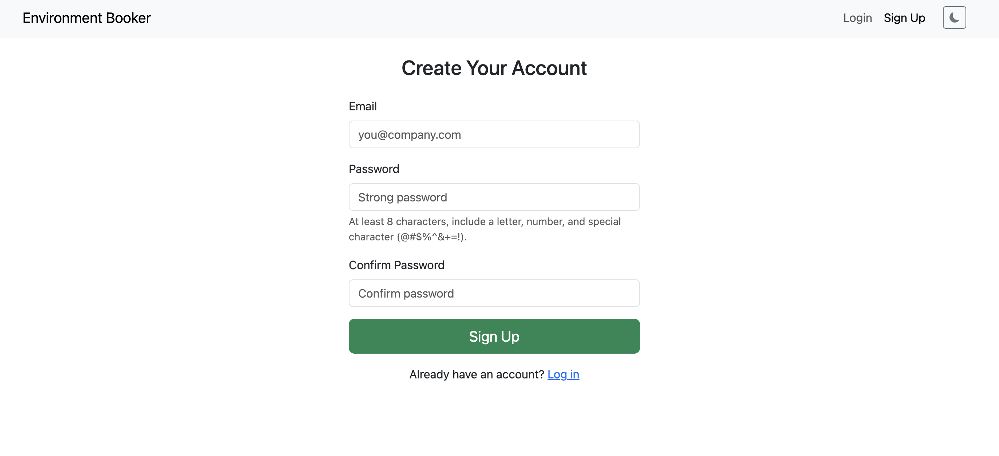

_Fig. 1 – Regular user registration screen_

### Admin Registration

> **Note:** Only authorised personnel should register new administrators.

1. Navigate to `/auth/register-admin`.  
2. Fill in **Email** and **Password**, then click **Register**.  
3. After success, log in with your new admin credentials.

_Fig. 2 – Administrator registration screen_

### Login

1. Go to **Login**.  
2. Enter your **Email** and **Password**.  
3. Click **Log In**.

_Fig. 3 – Login screen_

---

## Dashboard

After logging in, you land on your **Dashboard**:

- **Action Buttons** (top):  
  - **New Booking**
  - **Manage Bookings**
  - **Environments** ( Admin only)

- **Stats Cards** (row of 4):  
  - Upcoming bookings count  
  - Total environments  
  - Hours booked today  
  - Your next booking time & environment

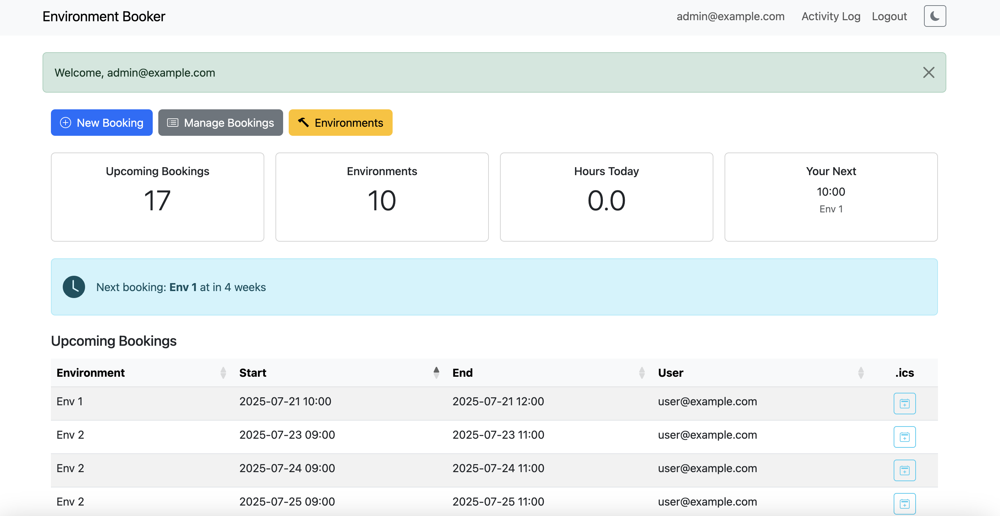

_Fig. 4 – Dashboard overview_

- **Next Booking Banner**: Shows your very next reservation with a **time-ago** widget.  
- **Upcoming Bookings Table**: Click any row to edit; use the **.ics** button to download calendar file.

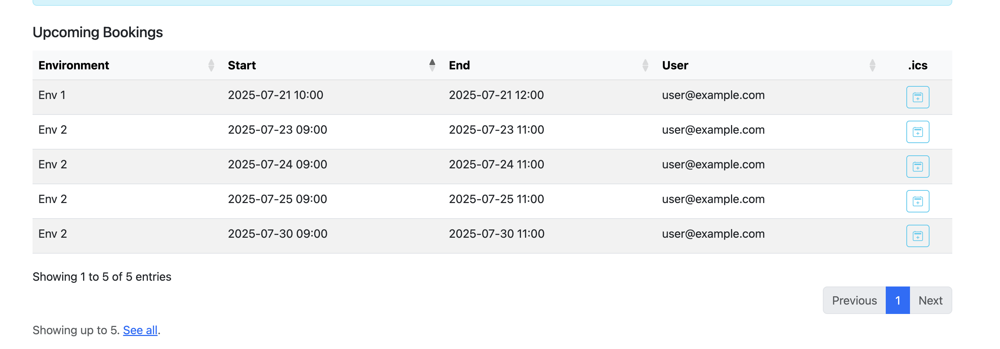

_Fig. 5 – Upcoming bookings on dashboard_

---

## Managing Environments (Admin)

### List Environments

1. Click **Environments** in the navbar.  
2. Use **Search by name** and **Filter by squad** inputs to narrow results.  
3. Change page length via the dropdown.

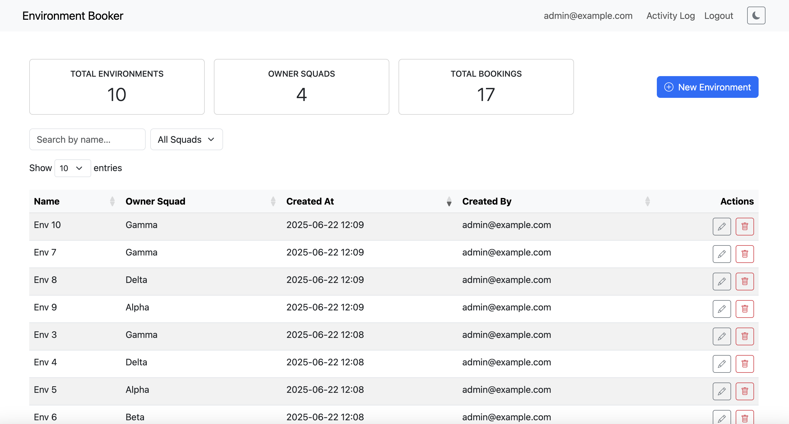

_Fig. 6 – Environment list with filters_

### Creating & Editing an Environment

1. Click **New Environment**.  
2. Fill **Name** and **Owner Squad**, then **Save**.  
3. To edit, click ✏️ on the right of the row.

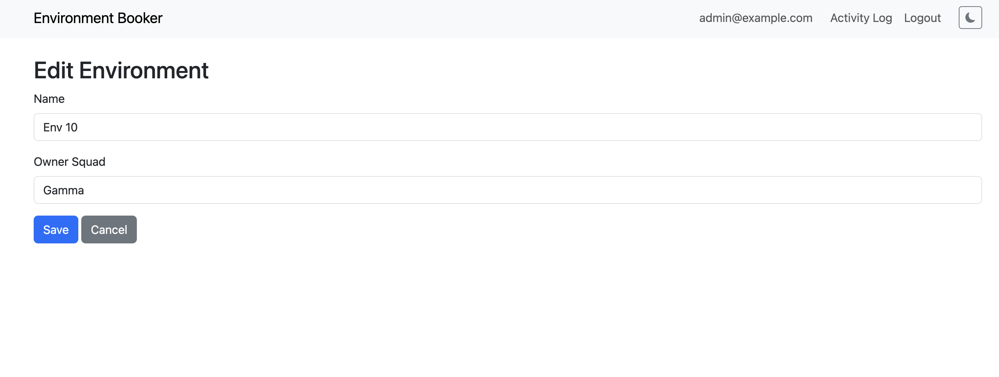

_Fig. 7 – Create/edit environment form_

### Deleting an Environment

1. Click 🗑️ for the environment you wish to remove.  
2. A confirmation modal appears, click **Delete** to confirm.

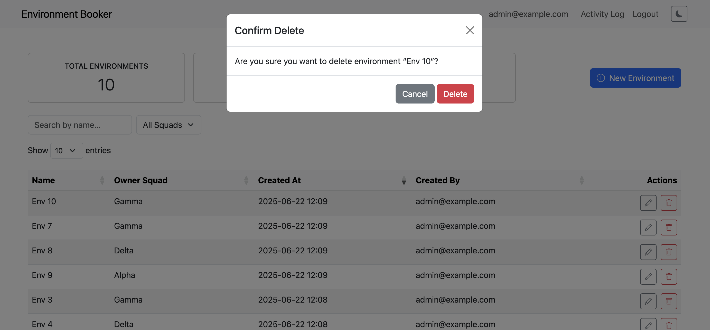

_Fig. 8 – Delete confirmation modal_

> **Note:** Environments with existing bookings cannot be deleted.

---

## Managing Bookings

### List & Filter Bookings

1. Click **Manage Bookings**.  
2. (Admin only) Toggle **All** vs **My** Bookings.  
3. Use search inputs:
   - **Environment** name  
   - **Date** picker  
   - **User** (Admin only)

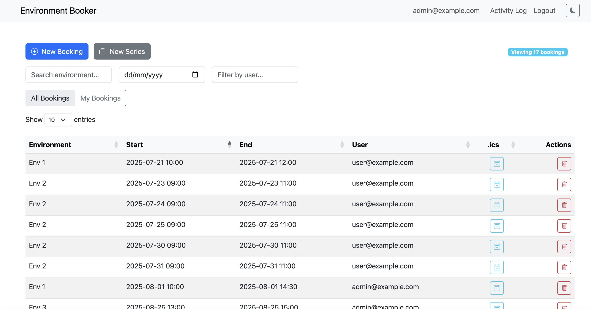

_Fig. 9 – Booking list with filters and view toggle_

### Single Booking

1. Click **New Booking**.  
2. Select **Environment**, pick **Start** & **End** times (HTML5 datetime picker).  
3. Click **Book**.

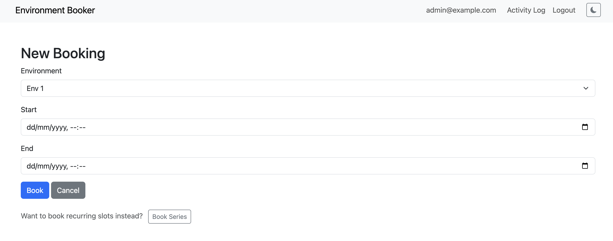

_Fig. 10 – Single booking form_

### Series Booking

1. Click **New Series Booking**.  
2. Select **Environment**, date‐range, days of week, and times.  
3. Click **Book Series**.

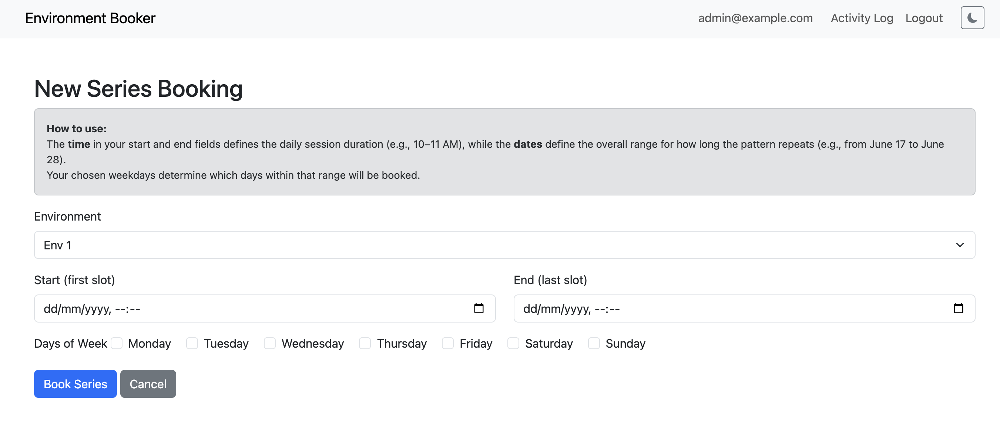

_Fig. 11 – Recurring series booking form_

### Conflict Suggestions & Force Book

- On clash, you’ll see an **alert** with a suggested slot ±3 hrs:  
  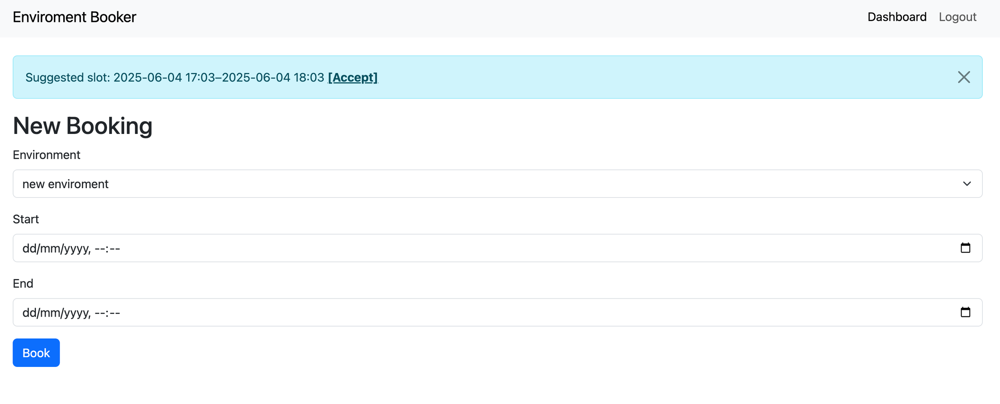  
- **Admins** can click **Force Book** to override.

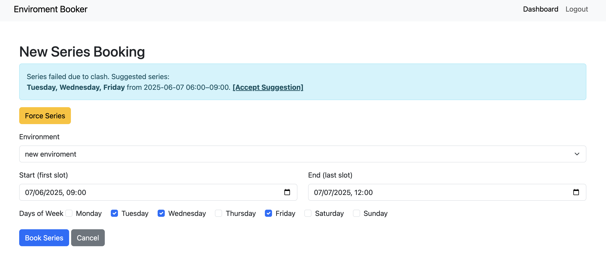

_Fig. 12 – Force booking override (admin)_

---

## Audit Log

1. Click **Activity Log** in the navbar.  
2. **Regular** users see only their own audit activity.  
3. List shows **timestamp**, **action**, and **details**.

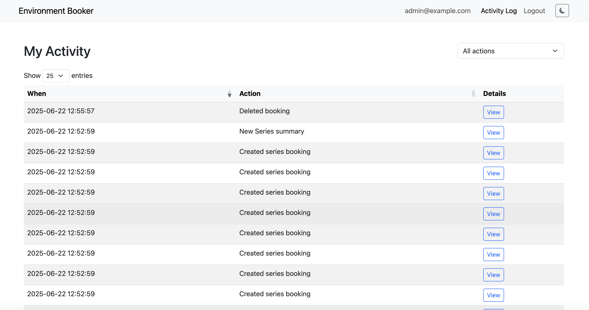

_Fig. 13 – Audit trail_

---

## Dark/Light Mode

- Toggle theme with the 🌙/☀️ button in the navbar.  
- Your choice persists via `localStorage`.

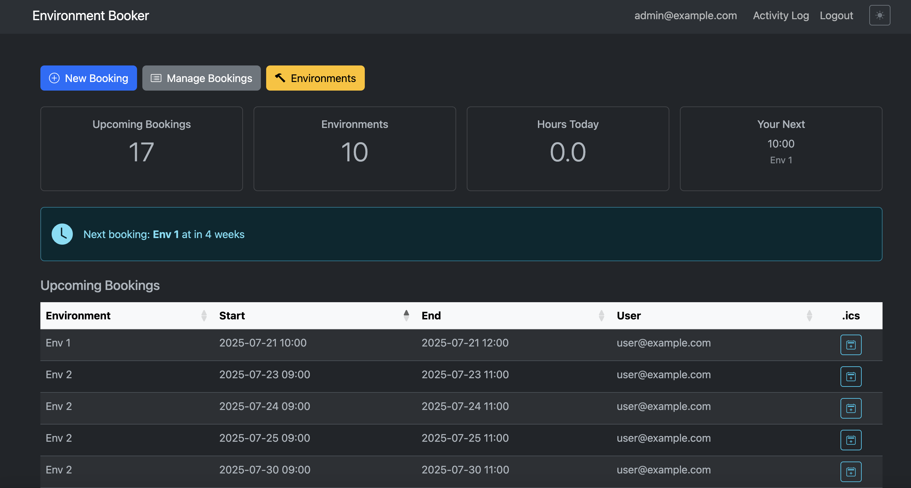

_Fig. 14 – Dark mode enabled_

---

## Keyboard Shortcuts & Accessibility

- **Skip to content** link (focusable) at top for screen‐readers.  
- All interactive elements have ARIA roles, labels, and tooltips.  
- Tables are fully navigable via keyboard.

---
